# Introduction

In this lab project report, we explore the design, implementation, and
evaluation of a distributed database management system for DNS records,
focusing on the implementation of iterative and recursive queries. We
investigate the benefits and challenges of using a distributed DBMS for
DNS, and compare the performance and efficiency of iterative and
recursive queries in a distributed system.

# Objectives

- To investigate the principles and concepts of distributed database
  management systems and how they can be applied to the domain name
  system (DNS).

- To design and implement a distributed database management system for
  storing DNS records, and evaluate its performance.

- To document the design, implementation, and evaluation of the
  distributed database management system and iterative and recursive
  queries for DNS records

# Theory

Distributed database management systems (DBMS) are designed to manage
large amounts of data across multiple nodes in a network. In a
distributed DBMS, data is partitioned and stored on multiple nodes,
which can improve performance, scalability, and fault tolerance.
Distributed DBMSs also offer parallel processing and load balancing
capabilities, which can provide faster response times and increased
availability. .

The Domain Name System (DNS) is a hierarchical and distributed naming
system that translates domain names into IP addresses. DNS plays a
critical role in connecting clients to web services, and its performance
and availability are critical to the functioning of the internet. In a
traditional DNS system, DNS servers are organized in a hierarchical
structure, with authoritative servers at the top level and recursive
servers at lower levels.

Implementing iterative and recursive queries for DNS records in a
distributed DBMS can improve performance and scalability. Iterative
queries involve the client sending a query to a DNS server and receiving
a response with either the requested resource record or a referral to
another DNS server. Recursive queries involve the DNS server performing
iterative queries on behalf of the client until it obtains the requested
resource record.

# Methodology

The methodology for this lab project report involved the following
steps:

- **System Design and Implementation:** We designed and implemented a
  distributed database management system (DBMS) using Java for storing
  and managing DNS records. The system was designed to support both
  iterative and recursive query approaches for resolving DNS queries,
  and we used RFC 1035 as the standard for DNS protocol and data
  format.

- **Iterative and Recursive Query Implementation:** We implemented
  both iterative and recursive query approaches for resolving DNS
  queries in the distributed DBMS. The iterative approach involves the
  client sending a query to a DNS server and receiving a response with
  either the requested resource record or a referral to another DNS
  server. The recursive approach involves the DNS server performing
  iterative queries on behalf of the client until it obtains the
  requested resource record.

- **Results and Analysis:** We analyzed the performance of the
  distributed DBMS for DNS records and compared the performance of
  iterative and recursive query approaches in the system.

# Experimental result

## DNS Client Server Communication

In this experiment, we want to establish a connection so that, a client
can talk to a DNS Server. We followed RFC 1035 instructions as
communication protocol.

```Java
 /*
+---------------------+
|        Header       |
+---------------------+
|       Question      | the question for the name server
+---------------------+
|        Answer       | RRs answering the question
+---------------------+
|      Authority      | RRs pointing toward an authority
+---------------------+
|      Additional     | RRs holding additional information
+---------------------+

*/

    /* HEADER
                                    1  1  1  1  1  1
        0  1  2  3  4  5  6  7  8  9  0  1  2  3  4  5
    +--+--+--+--+--+--+--+--+--+--+--+--+--+--+--+--+
    |                      ID                       |
    +--+--+--+--+--+--+--+--+--+--+--+--+--+--+--+--+
    |QR|   Opcode  |AA|TC|RD|RA|   Z    |   RCODE   |
    +--+--+--+--+--+--+--+--+--+--+--+--+--+--+--+--+
    |                    QDCOUNT                    |
    +--+--+--+--+--+--+--+--+--+--+--+--+--+--+--+--+
    |                    ANCOUNT                    |
    +--+--+--+--+--+--+--+--+--+--+--+--+--+--+--+--+
    |                    NSCOUNT                    |
    +--+--+--+--+--+--+--+--+--+--+--+--+--+--+--+--+
    |                    ARCOUNT                    |
    +--+--+--+--+--+--+--+--+--+--+--+--+--+--+--+--+
    */

    byte[] id = new byte[2]; // A 16 bit identifier
    byte[] flag = new byte[2]; // A 16 bit flag
    byte[] qdcount = new byte[2]; // A 16 bit qdcount
    byte[] ancount = new byte[2]; // A 16 bit ancount
    byte[] nscount = new byte[2]; // A 16 bit nscount
    byte[] arcount = new byte[2]; // A 16 bit arcount

    /* Question section format
                                        1  1  1  1  1  1
        0  1  2  3  4  5  6  7  8  9  0  1  2  3  4  5
        +--+--+--+--+--+--+--+--+--+--+--+--+--+--+--+--+
        |                                               |
        /                     QNAME                     /
        /                                               /
        +--+--+--+--+--+--+--+--+--+--+--+--+--+--+--+--+
        |                     QTYPE                     |
        +--+--+--+--+--+--+--+--+--+--+--+--+--+--+--+--+
        |                     QCLASS                    |
        +--+--+--+--+--+--+--+--+--+--+--+--+--+--+--+--+
        */

    byte[] qname;
    byte[] qtype = new byte[2]; // A 16 bit qtype
    byte[] qclass = new byte[2]; // A 16 bit qclass

    /*
    +---------------------+
    |        Answer       | RRs answering the question
    +---------------------+
    |      Authority      | RRs pointing toward an authority
    +---------------------+
    |      Additional     | RRs holding additional information
    +---------------------+
     */
    byte[] answer;
    byte[] authority;
    byte[] additional;

```

We used the following methods to parse data from message:

```Java
public static int parseIdOf(byte[] response);
public static int parseANCOUNT(byte[] response);
public static int parseNSCOUNT(byte[] response);
public static int parseARCOUNT(byte[] response);
public static List<List<String>> parseAnswers(byte[] response);
public static List<List<String>> parseAuthorities(byte[] response);
public static List<List<String>> parseAdditionals(byte[] response)


```

We first encode the information into bytes according to the protocol and
then send the packet to server.

```Java

// Create a DatagramSocket
DatagramSocket socket = new DatagramSocket();

// Send a message to the server
String domain = inputStream.nextLine();
String domainType = inputStream.nextLine();
Boolean recursive = false;


DNSrequest dnSrequest = new DNSrequest(1, recursive, domain, domainType);
byte[] buffer = dnSrequest.requestMessage();

```

The server receives and decodes the message. Then search accordingly to
it's record file. And then, enocodes the reponse and sends it back to
the client.

```Java
buffer = new byte[2048];
packet = new DatagramPacket(buffer, buffer.length);
socket.receive(packet);
byte[] authResponse = packet.getData();
List<List<String>> authAnswers = DNSrequest.parseAnswers(authResponse);
List<List<String>> authAuthoritatives = DNSrequest.parseAuthorities(authResponse);
List<List<String>> authAddiotinals = DNSrequest.parseAdditionals(authResponse);

DNSresponse dnsResponse =
new DNSresponse(request, 0, authAnswers, authAuthoritatives, authAddiotinals);
rootResponse = dnsResponse.responseMessage();

DatagramPacket authPacket =
new DatagramPacket(rootResponse, rootResponse.length, this.address, this.port);
socket.send(authPacket);
```

The client server communication is demonstrated below:

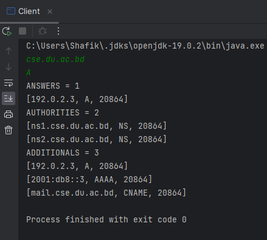

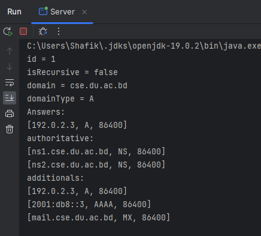

## Iterative Approach

In this experiment, our client requests to local server, which then
communicates with root server to find the ip of TLD server. Then, local
server communicates with TDL server to find the ip of Authoritative
server. Finally, the local server communicates with authoritative server
to find the ip of the requested domain and returns client.

The code for the All of the servers can be found here:
<https://github.com/reduan2660/DNS-RFC-1035/tree/main/P2%20-%20Iterative/src/main/java>

A demonstration of the iterative approach is presented below: (Client
initiated a communication by sending a request for the domain
cse.du.ac.bd)

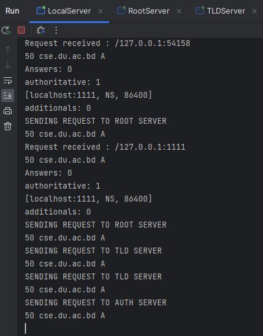

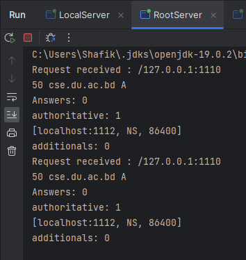

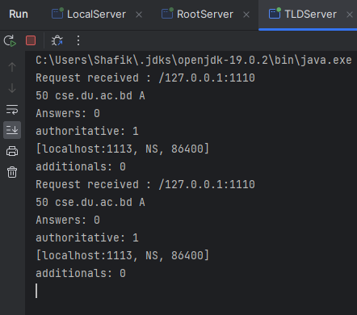

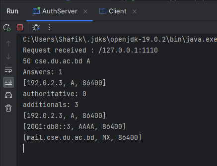

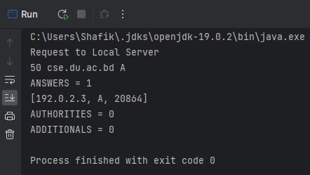

## Recursive Approach

In this experiment, our client requests to local server, which then
communicates with root server to find the ip of TLD server. If root
server does not have the ip, it makes a request to TLD server. If TLD
server does not have the ip, it makes a request to authoritative server
returns the reponse to TLD which returns the response to Root and root
returns the response to local server. Finally the responses are returned
back to Client.

The code for the All of the servers and Client can be found here:
<https://github.com/reduan2660/DNS-RFC-1035/tree/main/P3%20-%20Recursive/src/main/java>

A demonstration of the recursive approach is presented below: (Client
initiated a communication by sending a request for the domain
cse.du.ac.bd)

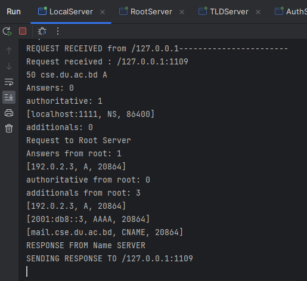

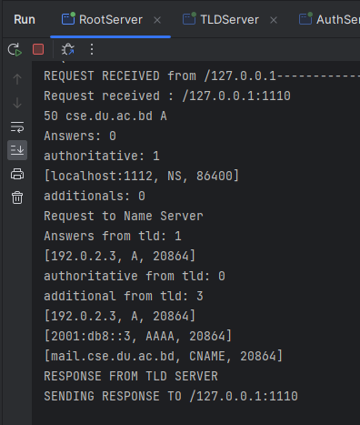

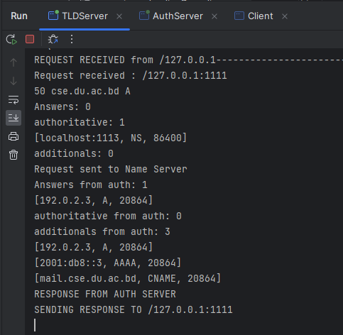

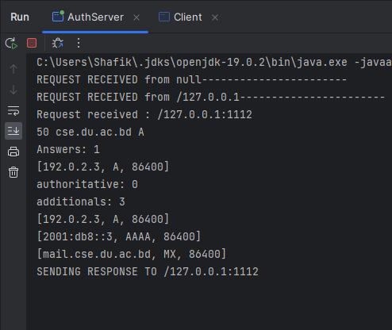

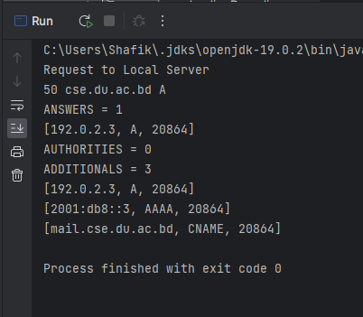

# Experiences

- We gained hands-on experience in designing and implementing a
  distributed DBMS using Java, which involved developing a deep
  understanding of the underlying architecture and design principles
  of distributed systems. We also gained experience in using
  open-source tools and standards such as RFC 1035 for DNS protocol
  and data format.

- We gained experience in implementing both iterative and recursive
  query approaches for resolving DNS queries, which involved
  developing a solid understanding of how DNS resolution works and how
  the different query approaches can be implemented in a distributed
  DBMS.

## Bibliography

RFC 1035 : <https://www.rfc-editor.org/rfc/rfc1035>

DNS Message Format : <https://www.geeksforgeeks.org/dns-message-format/>
:::
